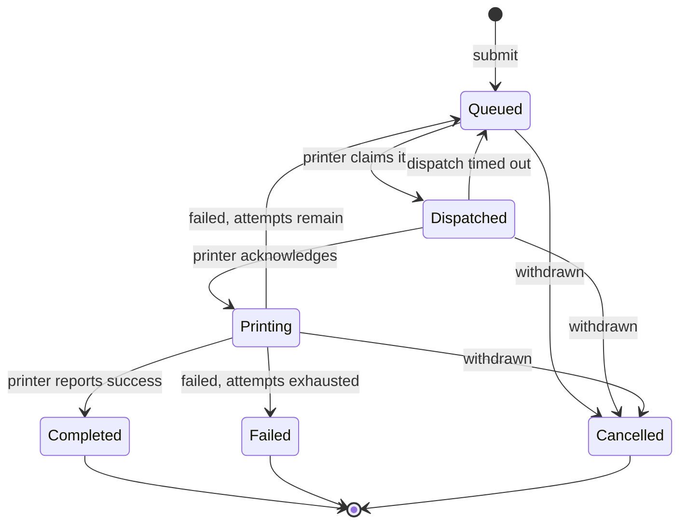

# Spoolr

A cloud print service: printers register with it, people submit documents to it, and it
gets those documents onto the right device without losing any of them.

A print spooler is a distributed task queue wearing a different hat. Work arrives faster
than it can be processed, it has to be ordered by priority, it has to survive the worker
dying halfway through, and it must never run the same job twice. Spoolr is built around
that observation, so most of the interesting code is queue mechanics rather than printing.

Built with ASP.NET Core on .NET 10, Entity Framework Core, Azure SQL, Azure Service Bus,
and Microsoft Entra ID. It runs end to end on a laptop with none of those Azure services.

---

## The problem this actually solves

The hard part is not sending a document to a printer. The hard part is everything that
happens when a printer misbehaves:

- **A printer takes a job and dies.** It never reports success and never reports failure.
  Without a sweep to notice, that job sits in `Dispatched` forever and the submitter is
  told their document is printing when nothing is printing.
- **Two service replicas poll at the same instant.** Both see the same queued job. If both
  win, the document prints twice.
- **A printer goes offline with fifty jobs queued behind it.** All fifty fail together. If
  they all retry at the same moment, they fail together again, forever.
- **A printer stops answering.** Nothing tells the service. It has to work that out from
  the absence of a signal rather than the presence of one.

Each of those has a specific mechanism behind it, described below.

## Job lifecycle



`PrintJob` owns this. Every transition goes through a method on the entity, checked against
an explicit table of allowed moves, so an invalid transition throws at the domain boundary
instead of writing an inconsistent row and being discovered later.

## Design decisions worth explaining

**The database is the queue.** Jobs are claimed with an atomic read-modify-write guarded by
a version column mapped as an EF Core concurrency token. When two replicas read the same
candidate and both write, the loser's `UPDATE` matches no row, and it retargets rather than
handing one document to two printers. Service Bus carries lifecycle events outward to other
systems; it is not the queue itself, so a broker outage cannot lose a job.

**A failed dispatch refunds its attempt.** If a printer never acknowledged a job, nothing
proves it ever received it. Burning one of three attempts on a delivery that may not have
happened would fail jobs that were never actually tried.

**Retries use full jitter.** Exponential growth alone re-synchronises a batch of failures.
Each retry is sampled uniformly from zero up to the capped exponential ceiling, so the fifty
jobs behind a dead printer come back spread out instead of in lockstep.

**Printer liveness is derived, not stored.** A device is online only while its last
heartbeat falls inside the heartbeat window. A printer that loses power is marked offline by
elapsed time, not by an update nobody is around to send.

**Priority is stored as a number, status as text.** Status is only ever compared for
equality, and reads better in a support query. Priority is what the dispatcher orders on,
and ordering the text form would rank `High` below `Low` and `Normal` alphabetically.

**Timestamps are stored as Unix milliseconds.** SQLite has no native offset-aware timestamp
and EF Core will not translate an inequality over one, which broke the dispatcher's range
scan outright. An integer sorts identically on SQLite and Azure SQL, so local development
and production exercise the same query shape.

**Printers authenticate differently from people.** A printer cannot complete an interactive
sign-in, so it presents a 256-bit random key issued once at registration, stored only as a
PBKDF2 hash. The unknown-printer path still verifies against a decoy hash, so response time
does not reveal which printer ids are real. People authenticate through Entra ID.

**Liveness does not touch the database.** A database outage should page someone, not make
the orchestrator restart every replica that is otherwise fine.

## Running it locally

No Azure subscription, no Docker, no database server. Every external dependency falls back
to a local equivalent: SQLite instead of Azure SQL, a logging publisher instead of Service
Bus, and a fixed local identity instead of Entra ID.

```bash
dotnet run --project src/Spoolr.Api
```

The API listens on `https://localhost:7256`. OpenAPI is at `/openapi/v1.json` in
development.

The local identity stand-in is refused outside the `Development` environment. Startup fails
rather than falling back, because a service that quietly accepts every caller is worse than
one that will not start.

### A full round trip

Register a printer. The device key comes back exactly once and is never recoverable.

```bash
curl -k -X POST https://localhost:7256/api/v1/printers -H 'Content-Type: application/json' -d '{"name":"HQ-Floor3","location":"Hyderabad / Floor 3","model":"Contoso LaserJet 9000","supportsColor":true,"maxPagesPerJob":500}'
```

Submit a job to it.

```bash
curl -k -X POST https://localhost:7256/api/v1/jobs -H 'Content-Type: application/json' -d '{"printerId":"PRINTER_ID","documentName":"report.pdf","pageCount":12,"priority":"High"}'
```

Claim it as the printer. This is the call a real device would poll.

```bash
curl -k -X POST https://localhost:7256/api/v1/device/jobs/next -H 'Authorization: DeviceKey PRINTER_ID:DEVICE_KEY'
```

Report it finished.

```bash
curl -k -X POST https://localhost:7256/api/v1/device/jobs/JOB_ID/result -H 'Authorization: DeviceKey PRINTER_ID:DEVICE_KEY' -H 'Content-Type: application/json' -d '{"succeeded":true}'
```

## API

| Method | Route | Who calls it |
| --- | --- | --- |
| `POST` | `/api/v1/printers` | Operator. Registers a device and issues its key. |
| `GET` | `/api/v1/printers` | Operator. Lists devices with derived status. |
| `POST` | `/api/v1/printers/{id}/retire` | Operator. Takes a device out of service. |
| `POST` | `/api/v1/jobs` | Operator. Queues a document. |
| `GET` | `/api/v1/jobs` | Operator. Filters by printer and status. |
| `POST` | `/api/v1/jobs/{id}/cancel` | Operator. Withdraws an unfinished job. |
| `POST` | `/api/v1/device/heartbeat` | Printer. Checks in. |
| `POST` | `/api/v1/device/jobs/next` | Printer. Claims the next job due. |
| `POST` | `/api/v1/device/jobs/{id}/acknowledge` | Printer. Confirms it started. |
| `POST` | `/api/v1/device/jobs/{id}/result` | Printer. Reports success or failure. |
| `GET` | `/health/live` | Orchestrator. No dependencies. |
| `GET` | `/health/ready` | Orchestrator. Checks the database. |

Device endpoints take the printer identity from the authenticated principal, never from the
route, so one printer cannot act on another's work. A job belonging to a different printer
is reported as missing rather than forbidden, so the endpoint cannot be used to discover
which ids exist.

## Observability

Request rate and latency say the API is up. They say nothing about whether anything is
printing. These are the metrics that answer that:

| Metric | What it tells you |
| --- | --- |
| `spoolr.queue.depth` | Jobs waiting that are due now. Climbing means work is not moving. |
| `spoolr.jobs.time_to_dispatch` | Seconds between submission and being claimed. |
| `spoolr.jobs.retried` | Attempts rescheduled rather than given up on. |
| `spoolr.jobs.recovered` | Jobs returned after a printer never acknowledged them. |
| `spoolr.jobs.failed` | Jobs that exhausted every attempt. |

Queue depth is sampled by the background sweep rather than queried when a metric is
scraped, so a monitoring system polling the gauge never reaches the database.

Exported through OpenTelemetry: to the console in development, and to Application Insights
when a connection string is configured.

## Tests

```bash
dotnet test
```

81 tests, split between the domain and the running service.

The unit tests cover the transition table, attempt accounting, heartbeat staleness, and the
backoff schedule. Store tests run against real SQLite rather than the in-memory provider,
which is what caught three problems the in-memory provider would have hidden: the untranslatable
timestamp comparison, EF issuing an `UPDATE` instead of an `INSERT` for domain-assigned GUID
keys, and the unique index on attempt number firing before the concurrency check.

The integration tests boot the real host through `WebApplicationFactory` and drive it over
HTTP with real routing, real authentication handlers, and real EF mappings. Only the
database is swapped, and it is swapped for another relational engine rather than a fake.

## Deploying

`infra/main.bicep` provisions Container Apps, Azure SQL with Entra-only authentication,
a Service Bus namespace with local auth disabled, Application Insights, and a user-assigned
managed identity holding only the Service Bus Data Sender role on the one topic it
publishes to. No connection string or shared key is stored anywhere.

```bash
az deployment group create --resource-group spoolr-dev --template-file infra/main.bicep --parameters sqlAdminObjectId=<object-id> sqlAdminLogin=<group-name>
```

The template compiles clean. It has not been deployed against a live subscription, so treat
the resource wiring as reviewed but unproven.

`MigrateOnStartup` is off by default. Several replicas starting at once would otherwise
race to create the same schema, so a deployed environment should migrate as its own step.

## Not done yet

- EF Core migrations. The schema is currently created with `EnsureCreated`, which is fine
  for local development and wrong for anything that needs to change a live database.
- A retry budget across printers. One device failing repeatedly can still occupy dispatcher
  attention that healthier devices could use.
- Document storage. Jobs carry a name and a page count, not the file itself.
